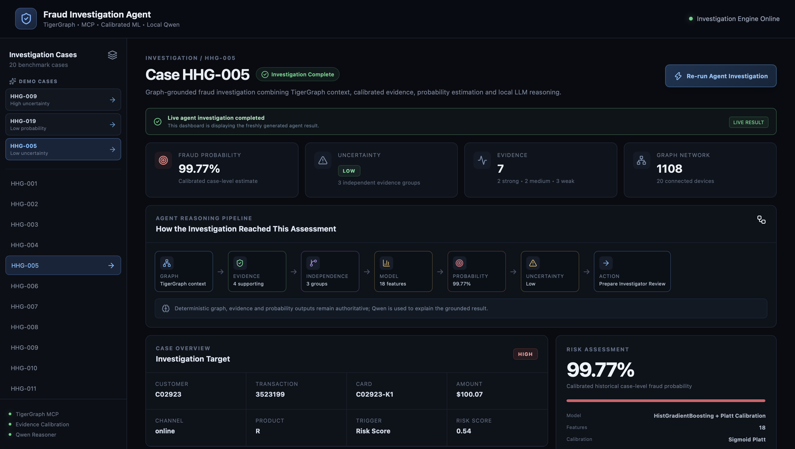
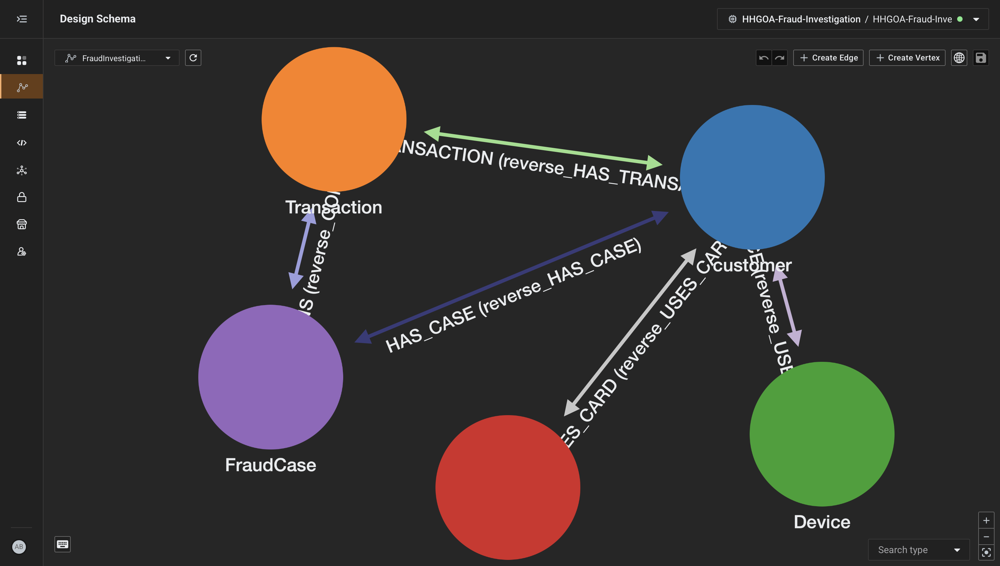
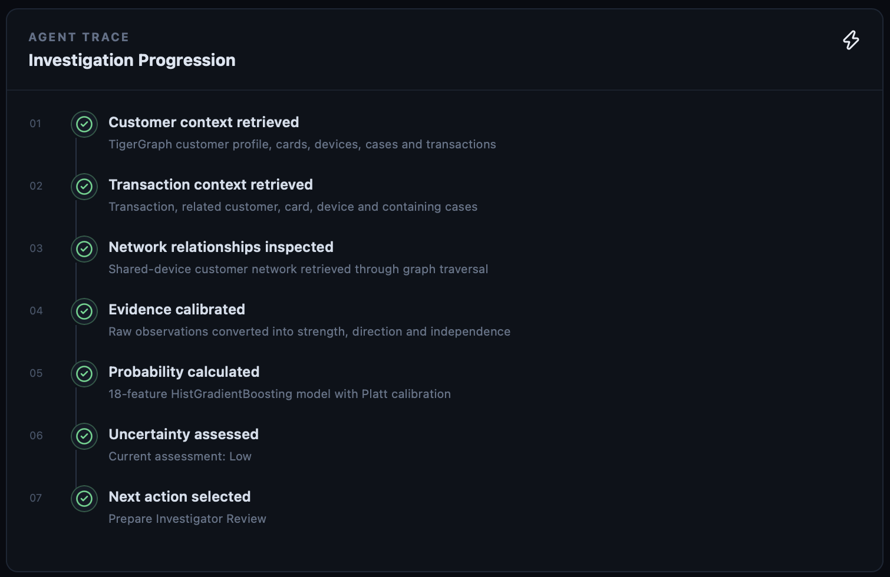
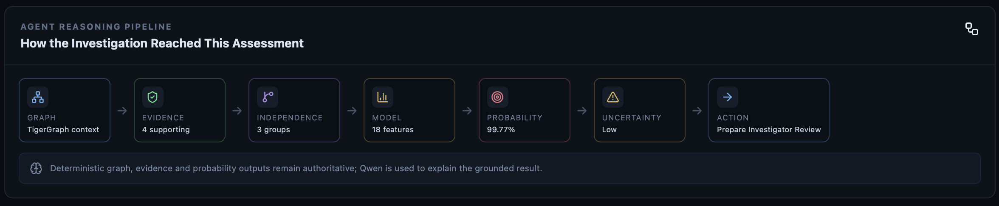

# Building an Agentic Fraud Investigation System with TigerGraph

When I started working on this problem, I initially thought of it as a fraud detection problem.

But during the implementation, it became clear that fraud investigation is not only about predicting whether a transaction is suspicious. An investigator also needs to understand the customer, their transactions, devices, cards, previous cases, and relationships with other customers.

So I built an **agentic fraud investigation system using TigerGraph**. The goal was not to make the LLM the source of truth, but to give an investigator a grounded workflow for moving from a case to an explainable next action.

The basic flow is:

```text
Case
  ↓
Graph investigation
  ↓
Evidence
  ↓
Risk assessment
  ↓
Uncertainty
  ↓
Next action
  ↓
Explanation
```



*The investigation dashboard brings the deterministic outputs and the explanation together in one view.*

## Using TigerGraph for investigation

The main graph is `FraudInvestigationGraph`.

I used these vertices:

```text
customer
Transaction
Device
Card
FraudCase
```

and relationships:

```text
customer ──HAS_TRANSACTION──> Transaction
customer ──USES_DEVICE──────> Device
customer ──USES_CARD────────> Card
customer ──HAS_CASE────────> FraudCase
FraudCase ──CONTAINS────────> Transaction
```

One useful example is finding customers connected through a device:

```text
Customer A
    ↓
  Device
    ↑
Customer B
```

This relationship can be discovered through graph traversal instead of storing another artificial `SHARED_WITH` edge.



*The graph view makes the relationships behind an investigation visible instead of leaving them implicit in a model score.*

## TigerGraph MCP

I connected the investigation agent to TigerGraph using **TigerGraph MCP**.

The agent can call graph queries such as:

```text
get_customer_profile()
get_shared_device_customers()
get_transaction_context()
```

So the flow becomes:

```text
Agent
  ↓
TigerGraph MCP
  ↓
TigerGraph
  ↓
Structured graph context
```

This keeps graph retrieval deterministic instead of asking the LLM to guess relationships. The returned graph context is then passed into the evidence and probability stages.

## Evidence calibration

Raw signals are not automatically treated as fraud evidence.

For example, the system can observe:

```text
card_testing_pattern
new_device_indicator
proxy_network_indicator
account_takeover_pattern
repeated_historical_abuse
shared_device_profile
```

I convert these observations into:

```text
Strong
Medium
Weak
Not material
```

and also classify them as:

```text
Supports fraud
Contradicts fraud
Context
```

I also introduced **independent evidence groups**.

This is important because two signals can describe almost the same behavior. I don't want to count correlated signals as completely independent evidence.

The important design choice is that evidence strength and evidence independence are separate concepts. A strong signal can still be correlated with another strong signal, so both should not automatically count as two independent reasons.

## Probability model

After evidence calibration, I build 18 features and pass them to a `HistGradientBoostingClassifier`.

The output is then calibrated using Platt/sigmoid calibration.

The final held-out test results were:

```text
ROC-AUC : 0.986844
PR-AUC  : 0.998618
Brier   : 0.028603
LogLoss : 0.092010
ECE     : 0.017772
```

The important point is that the probability is treated as a **case-level historical outcome estimate**, not as an independently proven fraud verdict. The held-out test set also has a high fraud prevalence, so these values should not be treated as production probabilities for a different population without external validation.

## Making it agentic

The interesting part is what happens after the probability is calculated.

The agent also assesses uncertainty and decides what should happen next.

For example:

```text
High uncertainty
      ↓
Gather additional evidence

Medium uncertainty
      ↓
Review evidence and network context

Low uncertainty
      ↓
Prepare investigator review
```

So the agent is not simply:

```text
Input → Model → Fraud
```

It becomes:

```text
Investigate
   ↓
Assess
   ↓
Decide what to investigate next
   ↓
Explain
```



*The trace exposes the steps between the case input and the final recommendation.*

## Where Qwen fits

For the LLM layer, I used **Qwen 2.5 locally through Ollama**.

I intentionally did not use the LLM to calculate the probability or discover graph relationships.

Instead, the deterministic system provides:

```text
Graph facts
Evidence
Probability
Uncertainty
Next action
```

Qwen then turns that information into a human-readable investigation explanation.

This separation made the system easier to control and reproduce.

## The UI

I also built a React UI with a FastAPI backend.

The UI shows:

- case information
- graph relationships
- evidence
- probability
- uncertainty
- next action
- agent trace
- GraphRAG reasoning
- Qwen explanation

The agent can be executed directly from the UI.

The dashboard screenshot above shows the main case view. The supporting view below shows how the system exposes its reasoning rather than hiding it behind the final score.



*The GraphRAG view shows how structured graph facts and calibrated evidence are assembled before the explanation is generated.*

## What I learned

The biggest thing I learned is that the LLM does not have to do everything.

A cleaner architecture is:

```text
TigerGraph       → relationships
Evidence layer   → evidence quality
ML model         → probability
Agent logic      → uncertainty + next action
Qwen             → explanation
```

Each component has a clear responsibility.

With more time, I would add stronger graph algorithms, a proper document-retrieval layer for GraphRAG, persistent case memory, investigator feedback, and better production monitoring.

For me, the interesting part of this project was not just building a fraud model.

It was turning the model into part of an investigation workflow.
